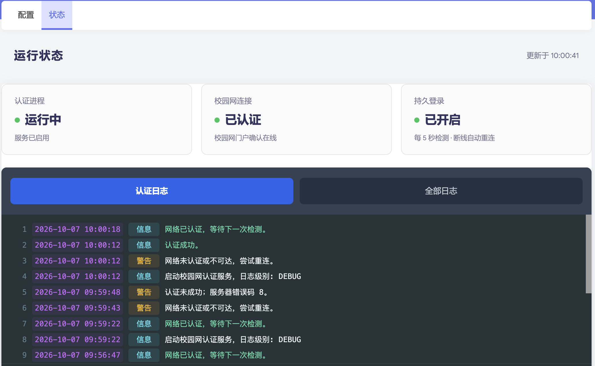
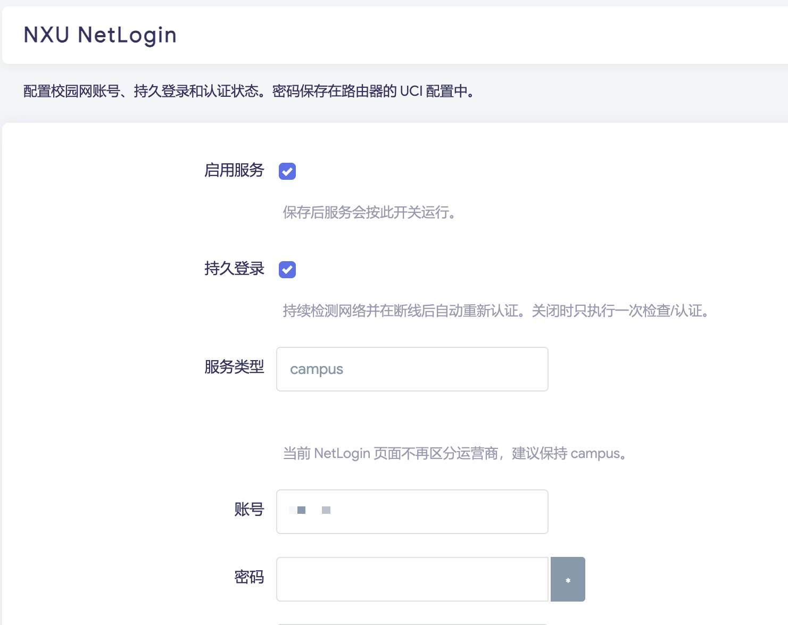

<div align="center">

# NXU NetLogin

**宁夏大学校园网认证 · 自动重连 · OpenWrt / iStoreOS**

支持当前 `netlogin.nxu.edu.cn` 统一认证门户，为 macOS、Linux 和路由器提供自动认证与连接监测。

[](https://github.com/fjd2004711/ruijie_nxu/releases/latest)
[](https://github.com/fjd2004711/ruijie_nxu/actions/workflows/build-ipk.yml)
[](#实测状态)
[](LICENSE)

[下载 IPK](https://github.com/fjd2004711/ruijie_nxu/releases/latest) · [快速安装](#快速安装) · [界面预览](#界面预览) · [更新日志](CHANGELOG.md)

</div>

## 功能亮点

| 功能 | 说明 |
| --- | --- |
| 自动认证与重连 | 默认每 5 秒检查门户在线状态；失败时逐步退避，最长等待 120 秒。 |
| 出口识别 | 优先使用门户看到的 IP / MAC，兼容 NAT 后的电脑与路由器 WAN。 |
| 精简固件适配 | 缺少 `base64` 时使用纯 `awk` 编码，保留 BusyBox ash 兼容性。 |
| LuCI 状态页 | 认证进程、校园网连接和持久登录分别展示，支持彩色日志与实时刷新。 |
| 有界系统日志 | 使用 OpenWrt `logd` 环形缓冲区，支持日志过滤、暂停和复制。 |
| HTTPS 认证 | 认证请求直接连接校园网门户，绕过环境代理并保留证书校验。 |

## 界面预览

### 运行状态

连接状态一目了然。认证日志突出成功与告警信息，切换“全部日志”可查看调试记录。

<p align="center">
  
</p>

### 插件配置

在 LuCI 中设置服务开关、持久登录、账号密码、日志级别和检测间隔。

<p align="center">
  
</p>

## 快速安装

### OpenWrt / iStoreOS：推荐 IPK

1. 从 [最新 Release](https://github.com/fjd2004711/ruijie_nxu/releases/latest) 下载 `netlogin-nxu_*.ipk`。
2. 在 LuCI 软件包页面上传并安装，或通过 SSH 执行：

   ```sh
   opkg install /tmp/netlogin-nxu_*.ipk
   ```

3. 打开 **服务 → NXU NetLogin → 插件设置**（部分已缓存的菜单显示为“配置”）。
4. 填写校园网账号和密码，开启“启用服务”和“持久登录”，保存并应用。
5. 在 **运行状态** 页面确认认证进程“运行中”、校园网连接“已认证”。

安装包包含认证脚本、`procd` 服务和 LuCI 页面，架构标记为 `all`。依赖由 `opkg` 安装，包括 `curl`、`ca-bundle`、`uci`、`luci-base` 和 `luci-compat`。

账号密码保存在路由器的 `/etc/config/netlogin-nxu`，该文件权限为 `600`。升级保留已有配置；仓库及发布包使用空账号配置。

### macOS / Linux：直接运行脚本

下载 [netlogin.sh](netlogin.sh)，使用系统 Bash 运行：

```sh
chmod +x netlogin.sh

# 持续运行，断线后自动重连
./netlogin.sh campus '你的账号' '你的密码'

# 单次检查或认证，完成后退出
./netlogin.sh campus '你的账号' '你的密码' once

# 注销校园网连接
./netlogin.sh campus '你的账号' '你的密码' logout
```

需要详细日志时，在操作参数后指定 `DEBUG`：

```sh
./netlogin.sh campus '你的账号' '你的密码' '' DEBUG
```

> 运行前，电脑或路由器的校园网出口应已取得 DHCP 地址和默认路由，并能访问认证门户。

## 命令行与服务管理

### 参数说明

```text
./netlogin.sh         campus <账号> <密码> [操作] [日志级别]
./netlogin_openwrt.sh campus <账号> <密码> [操作] [日志级别]
```

| 参数 | 可选值 | 默认行为 |
| --- | --- | --- |
| 服务类型 | `campus` | 为兼容旧命令保留，当前统一认证页使用校园网账号。 |
| 操作 | 留空、`once`、`logout` | 留空时持续监测并自动重连。 |
| 日志级别 | `ERROR`、`WARN`、`INFO`、`DEBUG` | `INFO`。 |

### OpenWrt 服务

```sh
# 从 UCI 配置启动认证服务
/etc/init.d/netlogin-nxu restart

# 查看进程状态及最近日志
/etc/init.d/netlogin-nxu status

# 启用开机启动
/etc/init.d/netlogin-nxu enable

# 查看校园网认证日志
logread -e ruijie-nxu
```

命令行配置：

```sh
uci set netlogin-nxu.main.enabled='1'
uci set netlogin-nxu.main.persistent_login='1'
uci set netlogin-nxu.main.service='campus'
uci set netlogin-nxu.main.username='你的账号'
uci set netlogin-nxu.main.password='你的密码'
uci set netlogin-nxu.main.log_level='INFO'
uci set netlogin-nxu.main.check_interval='5'
uci commit netlogin-nxu
/etc/init.d/netlogin-nxu restart
```

“持久登录”关闭时，脚本只执行一次检查或认证。LuCI 的“清空显示”只清除当前页面已显示的记录，系统日志仍可用于排查。

## 实测状态

2026-10-07 的验证环境与结果：

| 项目 | 环境 | 结果 |
| --- | --- | --- |
| `netlogin.sh` | macOS / 系统 Bash | 实际发送认证请求，服务器确认在线；NAT 出口识别和状态检测通过。 |
| `netlogin_openwrt.sh` | iStoreOS 24.10.6 / BusyBox ash | 登录成功，日志确认断线后自动认证恢复。 |
| LuCI | iStoreOS 24.10.6 / Argon | 状态读取、日志切换、自动刷新、暂停、清空显示和复制通过。 |
| IPK 升级 | `1.1.3-r2`，同一路由器 | 本地包实机安装成功，账号配置保留，安装文件与仓库一致。 |
| 回归检查 | Bash / POSIX sh | 7 项检查通过，覆盖编码回退、终端信息、状态判断与错误处理。 |

本次未进行路由器重启测试；其他固件的端到端验证待补充。

## 常见问题

**服务器提示“校验密码长度失败”**

先升级最新版本。旧版在精简固件缺少 `base64` 时可能发送空编码；新版自动回退到 `awk`，并在缺少必要命令时明确报错。

**进程运行，但校园网未认证**

查看认证日志。进程状态与门户在线状态分别检测；DHCP、路由、账号状态和门户响应都可能影响认证。

**能打开状态页，配置页无法加载**

确认已安装 `luci-compat`，它提供 Lua 页面需要的兼容组件。最新 IPK 已声明该依赖。

**macOS 日志写在哪里？**

默认使用 `/var/log/netlogin.log`，当前用户无写入权限时回退到 `/tmp/netlogin.log`。

## 开发与构建

凭据无关的本地检查：

```sh
python3 -m unittest discover -s tests
bash -n netlogin.sh
sh -n netlogin_openwrt.sh
```

[GitHub Actions](https://github.com/fjd2004711/ruijie_nxu/actions/workflows/build-ipk.yml) 使用 OpenWrt 24.10.2 x86/64 SDK 构建一个包含 LuCI 的 IPK；SDK 目标用于解析依赖，包本身不含架构相关二进制。工作流先执行语法和回归检查，再上传 `netlogin-nxu-ipk` 制品。

在匹配的 OpenWrt SDK 中手动构建：

```sh
make package/netlogin-nxu/compile V=s
```

## 旧认证系统

仍使用旧锐捷认证页的接入口，可使用兼容保留的脚本：

| 协议 | Bash | OpenWrt / ash |
| --- | --- | --- |
| 当前 NetLogin | [netlogin.sh](netlogin.sh) | [netlogin_openwrt.sh](netlogin_openwrt.sh) |
| 旧版锐捷 | [ruijie_nxu.sh](ruijie_nxu.sh) | [ruijie_nxu_openwrt.sh](ruijie_nxu_openwrt.sh) |

当前统一认证门户请使用 NetLogin 版本。

## 许可证

[Apache License 2.0](LICENSE)
